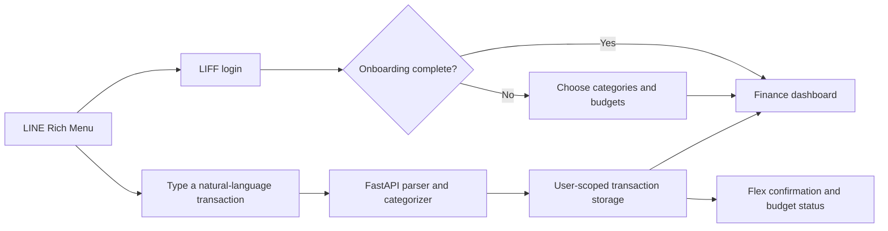

<p align="center">
  
</p>

<h1 align="center">เงินไปไหน? | MoneyTrack AI</h1>

<p align="center"><strong>LINE-first personal finance tracking with clear cashflow insights.</strong></p>

<p align="center">จดรายรับรายจ่ายด้วยภาษาธรรมชาติ ดูงบ กระแสเงินสด และคำแนะนำทางการเงินได้ในที่เดียว</p>

<p align="center">
  <a href="https://nextjs.org/"></a>
  <a href="https://fastapi.tiangolo.com/"></a>
  <a href="https://www.typescriptlang.org/"></a>
  <a href="https://developers.line.biz/"></a>
  <a href="#project-status"></a>
</p>

<p align="center">
  <a href="https://money-track-sandy.vercel.app">Web App</a> ·
  <a href="https://moneytrack-ai-api.onrender.com/health">API Health</a> ·
  <a href="docs/spec.md">Documentation</a>
</p>

---

## Why MoneyTrack AI?

Most expense trackers stop after recording a number. MoneyTrack AI is designed to answer the questions users actually have:

- Where did my money go?
- Am I close to exceeding a budget?
- Is my monthly cashflow positive or negative?
- How much may remain at the end of the month?
- Which category should I reduce first?

The primary experience lives inside LINE. A user can type `ข้าว 80`, `รับเงินลูกค้า 2500`, or `ค่าน้ำมันบริษัท 1200`; the backend parses the message, categorizes it, stores it under the verified LINE user, and replies with a branded Flex Message.

## Product Flow



## Features

### LINE experience

- Thai natural-language transaction entry
- Signed Messaging API webhook handling
- LIFF ID-token verification and user-scoped API access
- Branded Flex Messages for transaction confirmation, deletion, budgets, streaks, onboarding, and summaries
- Separate onboarding and main Rich Menus
- Rich Menu navigation to summary, insights, categories/budgets, transactions, settings, and LINE OA
- Webhook event deduplication using `webhookEventId`

### Finance workspace

- Create, edit, delete, filter, and bulk-manage transactions
- Personal and business transaction modes
- Custom income and expense categories
- Category or total budget modes with daily, weekly, and monthly cycles
- Daily and monthly income/expense charts
- Category donut charts and spending comparisons
- Cashflow, savings rate, expense-to-income ratio, and end-of-month projection
- Rule-based financial advisor with risks, warnings, actions, and saving opportunities
- Financial health score from 0–100
- What-if simulator for income and spending changes

### Automation and personalization

- Recurring daily, weekly, monthly, and yearly transactions
- Daily recording reminders through LINE
- Streak notifications
- Category memory from user corrections
- Configurable timezone, confirmation content, payment channels, language, and currency
- Thai and English UI

## Rich Menu

<table>
  <tr>
    <td align="center"><strong>New user</strong></td>
    <td align="center"><strong>Onboarded user</strong></td>
  </tr>
  <tr>
    <td></td>
    <td></td>
  </tr>
</table>

The large main-menu area sends a quick-start Flex Message with the **จดเลย** action. Navigation areas open LIFF routes, while the announcement area opens the configured LINE Official Account page.

## Tech Stack

| Layer | Technology |
|---|---|
| Frontend | Next.js 15, React 19, TypeScript, Tailwind CSS |
| Charts | Recharts |
| Backend | FastAPI, Python 3.12, Pydantic |
| Data analysis | Pandas, NumPy |
| Database | PostgreSQL in production, SQLite for local development/tests |
| LINE | Messaging API, LIFF, Flex Message, Rich Menu |
| Deployment | Vercel frontend, Render backend |
| Quality | pytest, Node test runner, ESLint, TypeScript, Next.js build |

## Architecture

```text
moneytrack-ai/
├── frontend/                 Next.js LIFF application
│   ├── src/app/liff/         Onboarding and finance routes
│   ├── src/components/       LIFF screens and interaction flows
│   └── src/lib/              API, auth, types, and user-flow helpers
├── backend/                  FastAPI service
│   ├── app/database.py       User-scoped repositories
│   ├── app/database_backend.py PostgreSQL/SQLite compatibility
│   ├── app/finance.py        Financial formulas and advisor rules
│   ├── app/line_*.py         LINE auth, webhook, parser, and Flex builders
│   ├── scripts/              Rich Menu setup
│   └── tests/                Backend tests
├── docs/                     Product and deployment documentation
└── README.md
```

The frontend obtains an ID token from LIFF and sends it as a Bearer token. The backend verifies it with LINE, derives the real user ID, and rejects requests that claim a different `line_user_id`. LINE webhooks use signature verification and derive identity from the signed event source.

More detail: [Architecture](docs/architecture.md) · [Product specification](docs/spec.md)

## Local Development

### 1. Backend

```powershell
cd backend
py -3.12 -m venv .venv
.\.venv\Scripts\Activate.ps1
pip install -r requirements.txt

$env:LINE_AUTH_REQUIRED="0"
$env:ENABLE_LINE_WEBHOOK_MOCK="1"

uvicorn app.main:app --reload --port 8000
```

API documentation is available at `http://localhost:8000/docs`.

### 2. Frontend

Create `frontend/.env.local`:

```env
NEXT_PUBLIC_API_BASE_URL=http://localhost:8000
NEXT_PUBLIC_LIFF_ID=2010521304-BrGvBhsP
NEXT_PUBLIC_FRONTEND_ORIGIN=http://localhost:3000
```

Then run:

```powershell
cd frontend
npm install
npm run dev
```

Open `http://localhost:3000/liff/onboarding` to preview onboarding with the local mock profile. End-to-end login and profile testing must use the official LIFF URL. Production keeps `LINE_AUTH_REQUIRED=1`.

## LINE Setup

Required Render variables:

```env
LINE_CHANNEL_SECRET=...
LINE_CHANNEL_ACCESS_TOKEN=...
LINE_RICH_MENU_MAIN_ID=...
LINE_LOGIN_CHANNEL_ID=2010521304
LINE_AUTH_REQUIRED=1
LIFF_APP_BASE_URL=https://liff.line.me/2010521304-BrGvBhsP
LINE_WEBHOOK_ALLOW_UNSIGNED=0
ENABLE_LINE_WEBHOOK_MOCK=0
FRONTEND_ORIGIN=https://money-track-sandy.vercel.app
DATABASE_URL=postgresql://...
SEED_DEMO_DATA=0
CRON_SECRET=...
```

Create or refresh the Rich Menus locally:

```powershell
cd backend
$env:LINE_CHANNEL_ACCESS_TOKEN="..."
$env:NEXT_PUBLIC_LIFF_ID="2010521304-BrGvBhsP"
$env:LINE_OA_URL="https://page.line.me/your-basic-id"
py scripts/setup_rich_menus.py
```

Copy the printed `LINE_RICH_MENU_MAIN_ID` to Render. Set the Messaging API webhook URL to:

```text
https://moneytrack-ai-api.onrender.com/line/webhook
```

Full instructions: [Deployment guide](docs/deployment.md)

## Tests and Quality Gates

Backend:

```powershell
cd backend
python -m pytest
```

Frontend:

```powershell
cd frontend
node --test --experimental-strip-types tests/*.test.mjs
npm run typecheck
npm run lint
npm run build
```

## API Overview

| Endpoint | Purpose |
|---|---|
| `GET /health` | Service health check |
| `GET/POST /transactions` | List or create user transactions |
| `GET/PUT/DELETE /transactions/{id}` | Transaction detail operations |
| `GET /dashboard` | Summary, charts, advisor, and health score |
| `POST /what-if` | Run a financial scenario |
| `GET/POST /recurring-transactions` | Manage recurring transactions |
| `GET/PUT /user-settings` | User personalization and Flex settings |
| `POST /line/webhook` | Signed LINE Messaging API webhook |
| `POST /users/line/{id}/onboarding` | Save initial categories and budgets |

Except for public health/category metadata and the signed LINE webhook, user-data routes require a verified LIFF ID token.

## Project Status

MoneyTrack AI is a portfolio MVP intended to demonstrate full-stack engineering, financial data analysis, rule-based AI behavior, and LINE platform integration.

> **Production note:** The Render deployment uses PostgreSQL. SQLite is limited to local development and tests because Render's web-service filesystem is ephemeral.

## Roadmap

- [x] Support managed PostgreSQL with a SQLite migration tool
- [ ] Add schema migrations and automated backups
- [ ] Add browser E2E tests for LIFF login and critical mobile flows
- [ ] Move recurring jobs to a reliable external scheduler
- [ ] Add CSV and bank-statement import
- [ ] Add anomaly detection and richer forecasting
- [ ] Add monitoring for webhook errors and failed LINE pushes

## Documentation

- [Product specification](docs/spec.md)
- [Architecture](docs/architecture.md)
- [Deployment](docs/deployment.md)
- [Resume bullets](docs/resume-bullets.md)

## Security

- Never commit LINE tokens, channel secrets, cron secrets, or production environment files.
- Rotate a token immediately if it appears in a screenshot, terminal recording, or Git history.
- Keep `LINE_AUTH_REQUIRED=1`, `LINE_WEBHOOK_ALLOW_UNSIGNED=0`, and `ENABLE_LINE_WEBHOOK_MOCK=0` in production.

---

<div align="center">
  Built as a Junior Full Stack + AI portfolio project focused on practical financial clarity.
</div>
