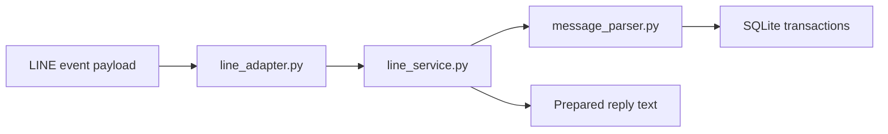
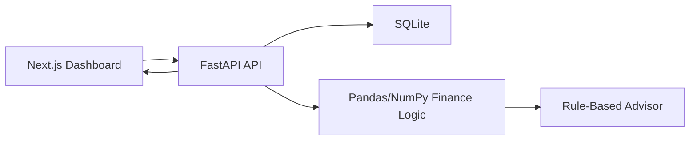

# Architecture

## Overview

MoneyTrack AI uses a split frontend/backend architecture:

- `frontend/`: Next.js 15 app router dashboard
- `backend/`: FastAPI service with SQLite persistence
- `docs/`: implementation and deployment documentation

## Backend

FastAPI routes:

- `GET /health`
- `GET /categories`
- `GET /transactions`
- `POST /transactions`
- `PUT /transactions/{id}`
- `DELETE /transactions/{id}`
- `GET /dashboard`
- `POST /what-if`
- `POST /line/webhook`

Important modules:

- `app/database.py`: SQLite setup and CRUD repository functions
- `app/models.py`: Pydantic models and category constants
- `app/finance.py`: Pandas/NumPy calculations, advisor rules, health score, charts, simulator
- `app/message_parser.py`: rule-based parser for Thai natural-language money messages
- `app/line_service.py`: mock LINE message handler, transaction creation, and daily summary replies
- `app/line_adapter.py`: LINE Messaging API event adapter that extracts text messages and prepares replies
- `app/main.py`: API route wiring and CORS

The backend seeds demo data on first startup so the UI has useful analytics immediately.

## Frontend

Important modules:

- `src/components/dashboard.tsx`: dashboard layout, charts, CRUD form, advisor, simulator
- `src/lib/api.ts`: typed API client
- `src/lib/types.ts`: shared frontend contracts
- `src/lib/i18n.ts`: English and Thai labels
- `src/lib/demo.ts`: offline sample data

If the backend is unavailable, the frontend shows sample data and an offline status pill. CRUD actions require the backend.

## LINE Flow

The current implementation prepares reply text and returns it from `/line/webhook`. A later production integration should verify `X-Line-Signature` and call LINE's Reply API with the reply token.

Production LINE mode uses:

- `LINE_CHANNEL_SECRET` to verify `X-Line-Signature`
- `LINE_CHANNEL_ACCESS_TOKEN` to call LINE Reply API

If those variables are not set, local mock testing still works and no outbound LINE request is sent.

## Data Flow

## Production Notes

SQLite is acceptable for portfolio MVP and single-instance demos. A production SaaS should move persistence to Postgres, add authentication, and scope all transactions by user or workspace.
